<div align="center">

# 🐙 The Beginner-Friendly Git Guide

**Everything you need to know about Git — from zero to confident developer.**

[](https://git-scm.com/)
[](https://github.com/)
[](LICENSE)
[](http://makeapullrequest.com)

*Simple · Visual · Practical*

</div>

---

## 📚 Table of Contents

| # | Section |
|---|---------|
| 1 | [🤔 What is Git?](#-what-is-git) |
| 2 | [🚀 Getting Started](#-getting-started) |
| 3 | [📁 The Three Areas of Git](#-the-three-areas-of-git) |
| 4 | [📅 Daily Workflow](#-daily-workflow) |
| 5 | [🌿 Branching](#-branching) |
| 6 | [🔀 Merging vs Rebasing](#-merging-vs-rebasing) |
| 7 | [🌍 Remote Collaboration](#-remote-collaboration) |
| 8 | [↩️ Undoing Changes](#️-undoing-changes) |
| 9 | [📦 Stash — Temporary Saves](#-stash--temporary-saves) |
| 10 | [📋 Cheat Sheet](#-cheat-sheet) |
| 11 | [🐛 Common Mistakes & Fixes](#-common-mistakes--fixes) |
| 12 | [✅ Best Practices](#-best-practices) |

---

## 🤔 What is Git?

> **Git** is a **version control system** — it tracks changes to your files over time so you can go back to any previous version, collaborate with others without overwriting each other's work, and maintain a full history of everything you've done.

Think of Git like a **time machine + collaborative workspace** for your code.

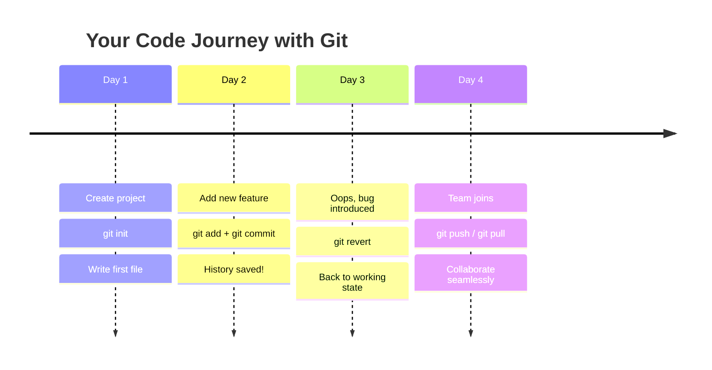

### Key Terms (plain English)

| Term | What it means |
|------|--------------|
| **Repository (repo)** | Your project folder tracked by Git |
| **Commit** | A saved snapshot of your changes |
| **Branch** | A parallel version of your project |
| **Remote** | A copy of your repo on a server (e.g., GitHub) |
| **Clone** | Download a remote repo to your machine |
| **Push** | Upload your commits to a remote |
| **Pull** | Download changes from a remote |
| **Merge** | Combine two branches together |
| **HEAD** | Pointer to your current position in history |

---

## 🚀 Getting Started

### Install & Configure Git

```bash
# Check if Git is already installed
git --version

# Configure your identity (required before first commit)
git config --global user.name  "Your Name"
git config --global user.email "you@example.com"

# Optional: set VS Code as default editor
git config --global core.editor "code --wait"
```

### Start a new project

```bash
# Option A: Start fresh
mkdir my-project
cd my-project
git init              # creates a hidden .git folder

# Option B: Clone an existing repo from GitHub
git clone https://github.com/username/repo-name.git
cd repo-name
```

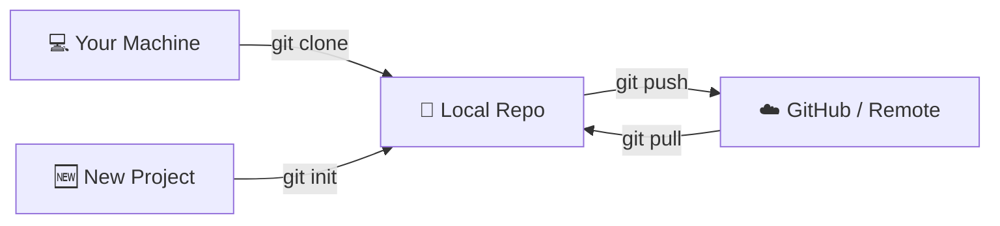

---

## 📁 The Three Areas of Git

This is the **most important mental model** in Git. Every file lives in one of three places:

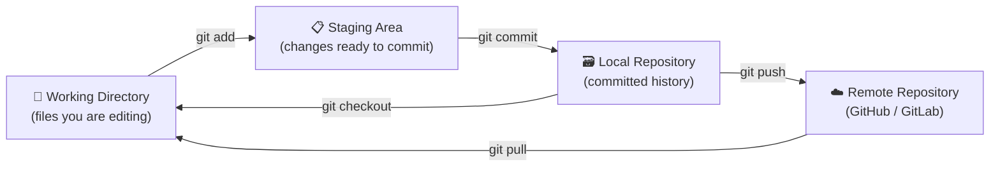

| Area | Description | How to move files here |
|------|-------------|----------------------|
| **Working Directory** | Your actual files — new/edited/deleted | Just edit files! |
| **Staging Area** | Changes you've selected to include in next commit | `git add` |
| **Local Repository** | Permanent history of committed snapshots | `git commit` |
| **Remote Repository** | Shared copy on GitHub/GitLab | `git push` / `git pull` |

---

## 📅 Daily Workflow

### Check what's going on

```bash
git status                    # show changed/staged files
git diff                      # show line-by-line changes (unstaged)
git diff --staged             # show staged changes (ready to commit)
git log                       # full commit history
git log --oneline --graph     # compact visual history
git log --oneline -10         # last 10 commits
```

### Stage your changes

```bash
git add file.txt              # stage a specific file
git add src/                  # stage an entire folder
git add .                     # stage everything in current folder
git add -A                    # stage ALL changes (including deletions)
git add -p                    # interactively pick chunks to stage
```

> 💡 **Tip:** `git add -p` lets you review each change before staging — great for keeping commits focused!

### Commit your changes

```bash
git commit -m "feat: add login page"
git commit -m "fix: correct typo in navbar"
git commit --amend --no-edit  # add forgotten changes to the last commit
```

### Commit message guide

```
<type>: <short summary>

Types:
  feat     → new feature
  fix      → bug fix
  docs     → documentation only
  style    → formatting, no logic change
  refactor → code restructure, no behavior change
  test     → adding tests
  chore    → build tools, dependencies
```

**Good commit message examples:**
```
feat: add user authentication
fix: resolve null pointer on empty cart
docs: update API usage in README
```

### View history

```bash
git log --oneline --graph --all
```

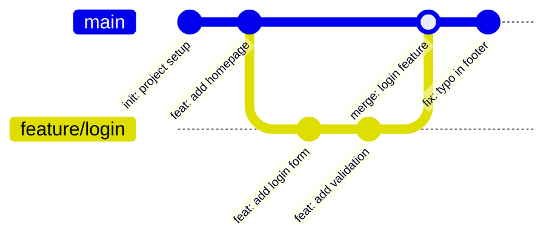

---

## 🌿 Branching

Branches let you work on features or fixes **without affecting the main codebase**.

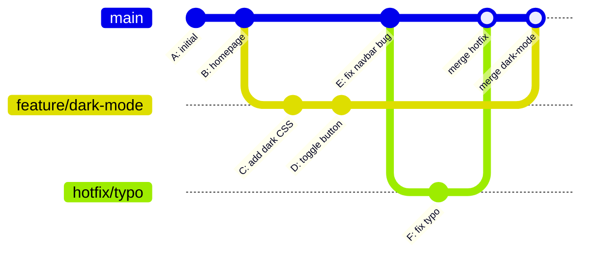

### Branch commands

```bash
# List branches
git branch              # local branches
git branch -r           # remote branches
git branch -a           # all branches

# Create a new branch
git branch feature/my-feature

# Switch to a branch (modern way — Git 2.23+)
git switch feature/my-feature

# Create AND switch in one step
git switch -c feature/my-feature

# Old way (still works)
git checkout feature/my-feature
git checkout -b feature/my-feature    # create + switch

# Rename current branch
git branch -m new-name

# Delete a branch
git branch -d feature/done            # safe delete (only if merged)
git branch -D feature/nope            # force delete

# Delete a remote branch
git push origin --delete feature/done
```

> ⚠️ **Note on `git checkout`:** It still works, but `git switch` (for branches) and `git restore` (for files) were introduced in Git 2.23 to make the intent clearer. Prefer the newer commands.

### Checkout a remote branch locally

```bash
git fetch origin
git switch -c feature/new origin/feature/new
# or the older way:
git checkout -b feature/new origin/feature/new
```

---

## 🔀 Merging vs Rebasing

These are two ways to integrate changes from one branch into another.

### Merge — preserves full history

```bash
git switch main
git pull
git merge feature/my-feature
```

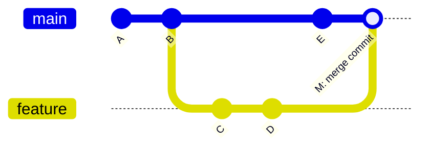

> ✅ **Use merge when:** integrating a completed feature into `main`, or on shared/public branches.

### Rebase — linear, clean history

```bash
git switch feature/my-feature
git rebase main

# If conflicts occur:
git add .
git rebase --continue
# Or to cancel:
git rebase --abort
```

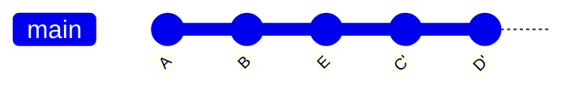

> 🔁 **Before rebase:** `A → B → E` (main) and `A → B → C → D` (feature branch)
>
> 🔁 **After rebase:** `A → B → E → C' → D'` — feature commits are replayed on top of main

> ✅ **Use rebase when:** keeping your feature branch up-to-date with main during development (before merging/PR).
>
> ❌ **Never rebase** a shared/public branch that others are using — it rewrites history!

---

## 🌍 Remote Collaboration

### Remote setup

```bash
git remote -v                          # list remotes
git remote add origin <url>            # add a remote
git remote rename origin upstream      # rename
git remote remove old-remote           # remove
```

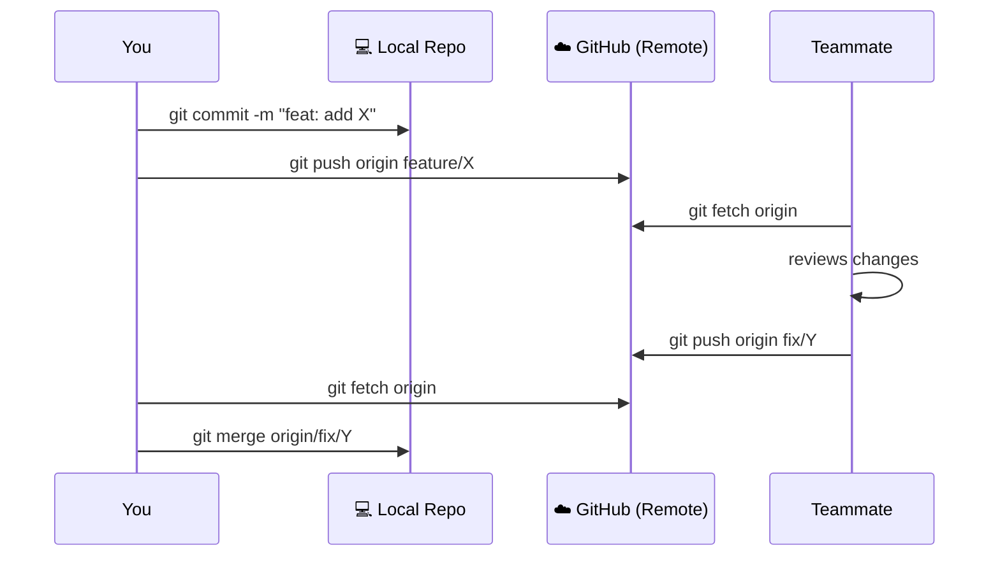

### Fetch, Pull, Push

```bash
# fetch = download changes but DON'T integrate yet
git fetch origin

# pull = fetch + merge (or fetch + rebase with --rebase flag)
git pull
git pull --rebase       # cleaner history

# push = upload local commits to remote
git push                                   # push current branch
git push -u origin feature/my-feature     # push + set upstream (first time)
git push --force-with-lease               # safer force push
```

> 💡 Prefer `--force-with-lease` over `-f` / `--force`. It prevents accidentally overwriting teammates' commits.

### Upstream tracking

```bash
# Set upstream so git push / git pull work without arguments
git push -u origin feature/my-feature

# Check tracking branches
git branch -vv
```

### Full collaboration flow

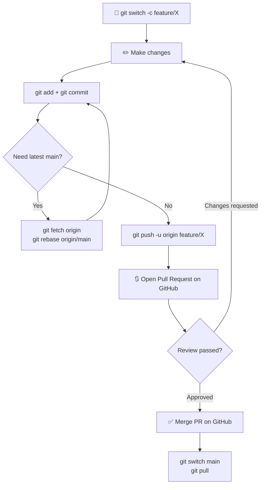

---

## ↩️ Undoing Changes

### Restore a file (discard edits)

```bash
# Discard changes in working directory (back to last commit)
git restore file.txt

# Unstage a file (keep changes, just remove from staging)
git restore --staged file.txt
```

### Reset — move HEAD backward

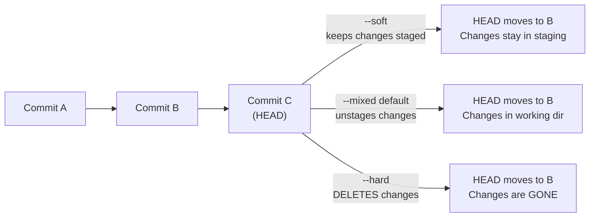

```bash
git reset --soft HEAD~1     # undo last commit, keep changes staged
git reset HEAD~1            # undo last commit, keep changes unstaged (default: --mixed)
git reset --hard HEAD~1     # undo last commit, DISCARD all changes

# Reset to a specific commit
git reset --hard abc1234

# Reset branch to match remote exactly
git fetch origin
git reset --hard origin/main
```

> ⚠️ `--hard` permanently deletes changes. Use with care!

### Revert — safe undo for shared branches

```bash
# Creates a NEW commit that undoes a previous one (safe for shared history)
git revert HEAD             # undo the last commit
git revert abc1234          # undo a specific commit
git revert HEAD~3..HEAD     # undo last 3 commits
```

> ✅ Use `git revert` instead of `git reset` when working on a shared branch. It keeps history intact.

### Reflog — your safety net

```bash
# See ALL actions Git has tracked (even "lost" commits)
git reflog

# Recover a "lost" commit or branch
git switch -c recovery-branch HEAD@{3}
```

> 💡 **Reflog saves you!** If you accidentally `reset --hard` or deleted a branch, `git reflog` lets you find and recover lost commits. It keeps entries for ~90 days by default.

---

## 📦 Stash — Temporary Saves

Stash is like a clipboard for your uncommitted changes — perfect when you need to switch tasks quickly.

```bash
git stash                        # stash current changes
git stash push -m "WIP: login"   # stash with a descriptive name

git stash list                   # see all stashes
git stash show stash@{0}         # inspect top stash

git stash pop                    # apply top stash and remove it
git stash apply stash@{1}        # apply a specific stash (keeps it in list)
git stash drop stash@{0}         # delete a specific stash
git stash clear                  # delete ALL stashes

# Create a branch from a stash
git stash branch feature/continue stash@{0}
```

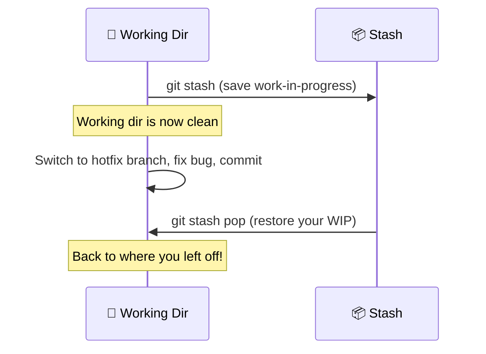

---

## 📋 Cheat Sheet

### Setup

| Command | Description |
|---------|-------------|
| `git config --global user.name "Name"` | Set your name |
| `git config --global user.email "email"` | Set your email |
| `git init` | Initialize a new repo |
| `git clone <url>` | Clone a remote repo |

### Core Workflow

| Command | Description |
|---------|-------------|
| `git status` | Show working tree status |
| `git add <file>` | Stage a file |
| `git add .` / `git add -A` | Stage all changes |
| `git commit -m "message"` | Commit staged changes |
| `git commit --amend` | Amend the last commit |
| `git log --oneline --graph` | View compact history |
| `git diff` | Show unstaged changes |
| `git diff --staged` | Show staged changes |

### Branching

| Command | Description |
|---------|-------------|
| `git branch` | List local branches |
| `git switch -c <branch>` | Create + switch to branch |
| `git switch <branch>` | Switch branch |
| `git merge <branch>` | Merge branch into current |
| `git rebase <branch>` | Rebase onto branch |
| `git branch -d <branch>` | Delete local branch (safe) |
| `git branch -D <branch>` | Force-delete local branch |

### Remote

| Command | Description |
|---------|-------------|
| `git remote -v` | List remotes |
| `git fetch origin` | Download without merging |
| `git pull` | Fetch + merge |
| `git pull --rebase` | Fetch + rebase |
| `git push` | Push current branch |
| `git push -u origin <branch>` | Push + set upstream |
| `git push --force-with-lease` | Safer force push |

### Undoing

| Command | Description |
|---------|-------------|
| `git restore <file>` | Discard working dir changes |
| `git restore --staged <file>` | Unstage a file |
| `git reset --soft HEAD~1` | Undo commit, keep staged |
| `git reset HEAD~1` | Undo commit, keep unstaged |
| `git reset --hard HEAD~1` | Undo commit, delete changes ⚠️ |
| `git revert HEAD` | Safe undo via new commit |
| `git reflog` | View all recent actions |

### Stash

| Command | Description |
|---------|-------------|
| `git stash` | Save current changes |
| `git stash pop` | Restore last stash |
| `git stash list` | List all stashes |
| `git stash apply stash@{n}` | Apply specific stash |
| `git stash drop stash@{n}` | Delete specific stash |

---

## 🐛 Common Mistakes & Fixes

### I committed to `main` directly!

```bash
# Create a new branch with those commits
git switch -c feature/oops-branch

# Reset main back to where it should be
git switch main
git reset --hard origin/main

# Your commits are safely on the new branch
git switch feature/oops-branch
```

### I forgot to add a file to my last commit!

```bash
git add forgotten-file.txt
git commit --amend --no-edit   # adds to last commit without changing the message
```

> ⚠️ Only do this if you haven't pushed yet (or use `--force-with-lease` if you have).

### I pushed a bad commit to my branch!

```bash
# Option 1: Add a fix commit (safest for shared branches)
git revert HEAD
git push

# Option 2: Rewrite history (only for your own branch)
git reset --soft HEAD~1       # put changes back to staging
# fix the issue...
git commit -m "fix: corrected approach"
git push --force-with-lease
```

### My branch is out of date with main and has conflicts!

```bash
git fetch origin
git rebase origin/main

# When a conflict occurs:
# 1. Open conflicted files and look for <<<<<<< markers
# 2. Edit the file to keep what you want
# 3. git add <resolved-file>
# 4. git rebase --continue
# Repeat for each conflict
```

### I accidentally deleted a branch or did a hard reset!

```bash
git reflog                                         # find the commit SHA you need
git switch -c recovered-branch HEAD@{3}            # create branch from that point
```

### How do I read merge conflict markers?

```
<<<<<<< HEAD (your changes)
const color = "blue";
=======
const color = "red";
>>>>>>> feature/new-colors (their changes)
```

1. Decide which version is correct (or combine both)
2. Remove the `<<<<<<<`, `=======`, and `>>>>>>>` marker lines
3. `git add` the resolved file
4. `git merge --continue` (or `git rebase --continue`)

### How do I compare two branches?

```bash
git diff main..feature/my-feature              # full diff between branches
git diff main..feature/my-feature -- src/      # only changes in src/ folder
git log main..feature/my-feature --oneline     # commits only in feature branch
```

---

## ✅ Best Practices

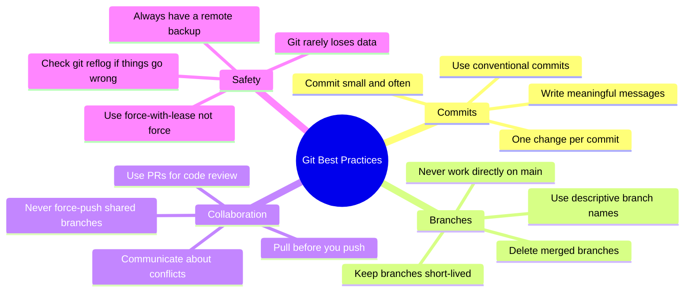

### Branch naming convention

```
feature/short-description    → new features
fix/bug-description          → bug fixes
hotfix/critical-issue        → urgent production fixes
chore/task-description       → maintenance tasks
docs/what-you-documented     → documentation
```

### The daily developer loop

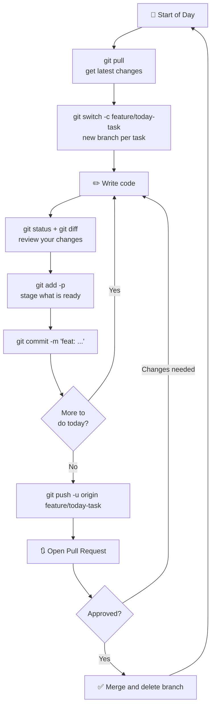

---

<div align="center">

## 🚀 One-Line Philosophy

**`branch → commit often → push → PR → merge → repeat`**

---

*Made with ❤️ for developers learning Git.*

*Star ⭐ this repo if it helped you!*

</div>
